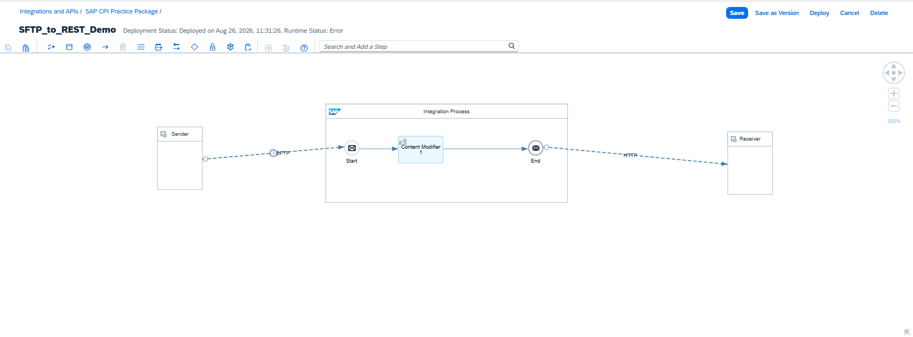
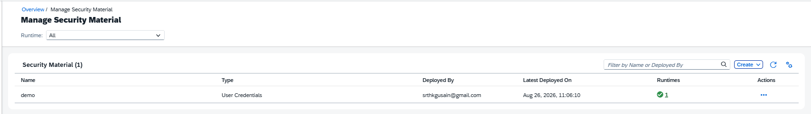
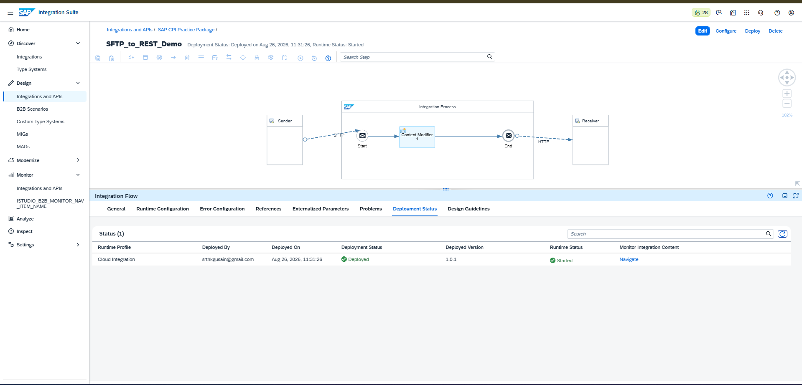
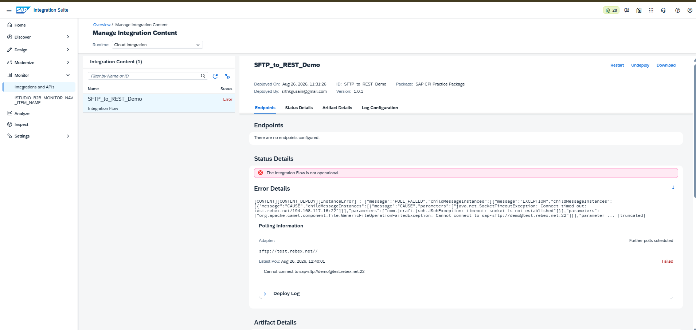
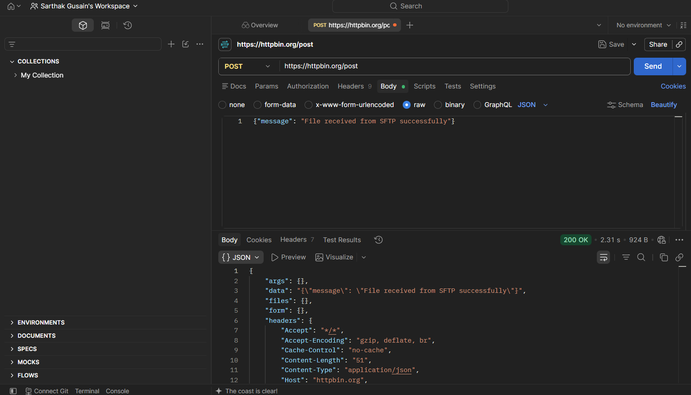

# iFlow 01: SFTP to REST Integration

## Overview
This integration flow demonstrates a file-based integration pattern in SAP Integration Suite (Cloud Integration): polling a file from an SFTP server, transforming the message payload, and forwarding it to a REST (HTTP) endpoint.

## Architecture
SFTP Sender (test.rebex.net) → Content Modifier → HTTP Receiver (httpbin.org)

| Step | Purpose |
|------|---------|
| **Sender (SFTP)** | Polls a public test SFTP server for a file |
| **Content Modifier** | Sets a constant message body confirming file receipt |
| **Receiver (HTTP/REST)** | Sends the processed message via POST to a REST endpoint |

## Configuration

- **Sender Adapter:** SFTP, Address: `test.rebex.net`, Authentication: User Name/Password
- **Security Material:** Created via Monitor → Manage Security Material (User Credentials, deployed to Cloud Integration + Integration Cell runtimes)
- **Content Modifier:** Message Body set to a constant string confirming successful file receipt
- **Receiver Adapter:** HTTP, Method: POST, Address: `https://httpbin.org/post`, Authentication: None

## Skills Demonstrated
- Building an Integration Flow from scratch in SAP Integration Suite
- Configuring SFTP sender adapters and connection parameters
- Creating and deploying Security Material (credential store) for secure authentication
- Using Content Modifier for message transformation
- Configuring HTTP/REST receiver adapters
- Deploying and monitoring integration content
- Debugging real deployment/runtime errors using SAP CPI's monitoring tools

## Deployment Status
✅ Successfully designed, saved, and **deployed** in SAP BTP Trial (Cloud Integration runtime).

## Known Limitation: External SFTP Connectivity

During runtime testing, the flow returned the following error:
GenericFileOperationFailedException: Cannot connect to sap-sftp://demo@test.rebex.net:22
Caused by: SocketTimeoutException: Connect timed out

**Root cause analysis:** This is a `SocketTimeoutException` when SAP BTP Trial's Cloud Integration runtime attempts an outbound connection to a public external SFTP server on port 22. This points to a network/firewall restriction on outbound connections from the trial tenant, rather than an issue with the flow design.

**Verification steps taken:**
1. Re-deployed the iFlow — same timeout occurred, confirming this is a consistent environment restriction, not a transient failure.
2. Independently verified the receiver-side logic using **Postman**: sent the exact same POST request and payload directly to the HTTP receiver endpoint (`https://httpbin.org/post`) and received a `200 OK` response with the payload correctly echoed back — confirming the REST integration logic itself is correct and functional.

This isolates the issue specifically to the SFTP sender's outbound connection in the trial environment, and confirms the rest of the integration logic (message transformation + REST delivery) works as designed.

## Screenshots

**iFlow Design**

**Security Material Created**

**Deployment Success**

**Runtime Error (Troubleshooting)**

**Postman Verification**

